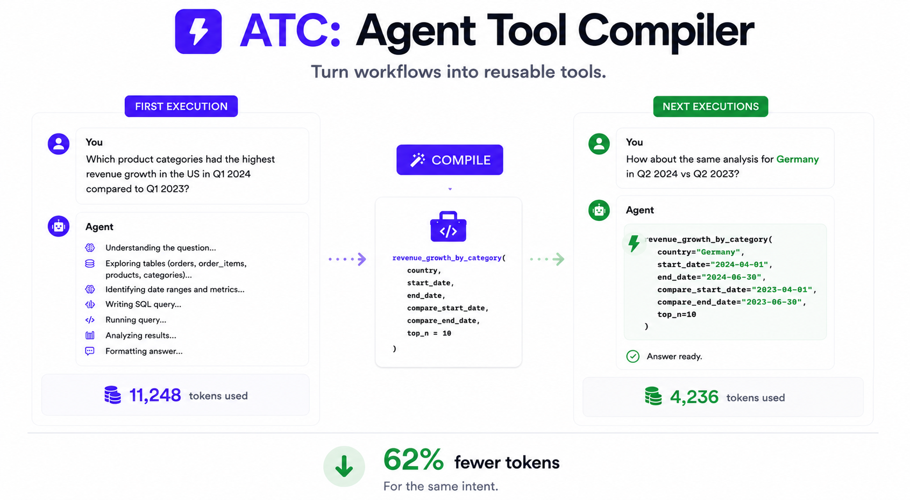
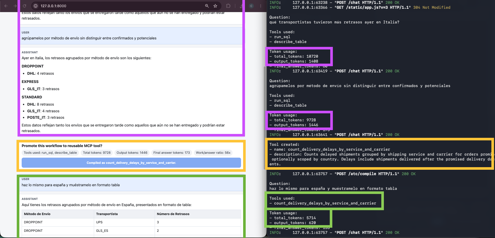

# ATC — Agent Tool Compiler



**Agents shouldn’t solve the same workflow twice.**

ATC is an experimental side project about a simple idea:

> When an agent successfully solves a useful workflow, promote that workflow into a reusable tool.

The current demo shows a LangGraph data agent answering logistics analytics questions. The first time, the agent explores the schema, writes SQL, calls tools, and spends a lot of tokens. If the result looks useful, the user can click **Compile this workflow**. ATC then asks a compiler model to turn that successful execution into a reusable capability that the agent can call directly next time.

This is not a production platform. It is a prototype built to explore a product-shaped question:

**Can agents discover repeated workflows and turn them into cheaper, faster automations?**

## Screenshots



## Why This Is Interesting

LLM agents are powerful, but they often burn tokens rediscovering the same path:

- inspect the schema
- decide which tables matter
- write a query
- fix mistakes
- summarize the result

That is fine once. It is wasteful the tenth time.

ATC treats a successful agent run as a compile target. Instead of storing every trace forever or building a heavy workflow system, it persists only the reusable capability:

```text
successful run -> compile candidate -> reusable tool
```

The bet is that many high-token agent runs are really workflow discovery in disguise.

## Demo Story

Before compile:

```text
User: What carriers had the most delays yesterday in Italy?
```

The LangGraph agent may inspect tables, write SQL, repair SQL, and return an answer. The terminal shows token usage and the work/answer ratio:

```text
Tools used:
- run_sql
- describe_table

Token usage:
- total_tokens: 10720
- output_tokens: 1408
- final_answer_tokens: 60
- work_to_answer_ratio: 179x
```

Then the user clicks:

```text
Compile this workflow
```

ATC creates a capability, for example:

```text
Tool created:
- name: count_delivery_delays_by_service_and_carrier
- description: Counts delayed shipments grouped by shipping service and carrier, optionally scoped by country.
```

After compile:

```text
User: Do the same for Spain and show it as a table.
```

Now the agent can call the compiled capability directly instead of rediscovering the workflow from scratch.

## What The Demo Includes

- LangGraph ReAct agent
- FastAPI web demo
- SQLite logistics dataset with thousands of generated orders, shipments, carriers, warehouses, costs, and tracking events
- Tool usage capture
- Token usage and work/answer ratio
- Manual workflow compilation
- Persisted capabilities in `.atc`
- Generated LangChain tools from compiled capabilities
- Basic MCP server for exposing compiled capabilities
- Tests around registries, workflow execution, compiler validation, and response analysis

## Architecture

```text
User question
    |
    v
LangGraph ReAct agent
    |
    +--> base tools: list_tables, describe_table, run_sql
    |
    +--> compiled ATC capabilities loaded as tools
    |
    v
ATC decorate_response(...)
    |
    +--> answer
    +--> tools used
    +--> token usage
    +--> compile candidate
    |
    v
User clicks "Compile this workflow"
    |
    v
ATC compiler model
    |
    v
.atc/capabilities/<tool>.json
```

The agent itself is a LangGraph prebuilt ReAct agent. ATC sits around it: it registers base tools, loads compiled capabilities, decorates responses, and compiles successful executions into reusable tools.

## Quickstart

```bash
uv sync
cp .env.example .env
# add OPENAI_API_KEY to .env
uv run python examples/langgraph_data_agent/server.py
```

Then open:

```text
http://localhost:8000
```

Suggested demo flow:

```text
qué transportistas tuvieron más retrasos ayer en Italia?
```

```text
agrúpamelos por método de envío sin distinguir entre confirmados y potenciales
```

Click **Compile this workflow**.

Then ask:

```text
haz lo mismo para España y muéstramelo en formato tabla
```

## Commands

```bash
uv run pytest
uv run ruff check .
uv run atc inspect
uv run atc serve-mcp --project-dir .atc
```

## Public API

```python
from agent_tool_compiler import ATC

atc = ATC(project_dir=".atc", semantic_model=compiler_model)

tools = atc.tools([
    list_tables,
    describe_table,
    run_sql,
])

agent = build_agent(tools=tools)
result = agent.invoke(...)

response = atc.decorate_response(
    question=user_question,
    agent_result=result,
)
```

Users pass tools once. `atc.tools(base_tools)` registers base tools, loads compiled capabilities from `.atc/capabilities`, and returns base tools plus generated LangChain tools.

## What Gets Persisted

Only compiled capabilities are persisted:

```text
.atc/
├── registry.json
└── capabilities/
    └── count_delivery_delays_by_service_and_carrier.json
```

Raw traces and compile candidates are not persisted in v1. The frontend sends the full compile candidate back to the backend only when the user clicks compile.

## MCP

The web demo does not call tools through an MCP server. It loads compiled capabilities directly as LangChain tools inside the FastAPI process.

There is also a basic MCP server:

```bash
uv run atc serve-mcp --project-dir .atc
```

That exposes compiled capabilities as MCP tools for external MCP clients. This part is intentionally minimal.

## Current Limitations

This is an experiment, not a hardened product.

- Manual compile only.
- No clustering or automatic workflow discovery yet.
- No candidate database.
- V1 focuses on tool-call workflows, especially SQL analytics workflows.
- Compiler quality depends heavily on the compiler model.
- Generated workflows are validated, but should still be reviewed before real use.
- MCP support is basic.
- Security model is demo-grade.

## Why I Built This

I built ATC as a portfolio side project to explore an idea I think is very sellable right now:

**Agents are expensive when they repeatedly rediscover workflows.**

If a system can notice useful repeated work and turn it into reusable capabilities, it can make agents cheaper, faster, and easier to operationalize.

This repo is a small, working prototype of that direction.

## Author

Created by Carlos Navarro Astiasarán.

## License

MIT.
